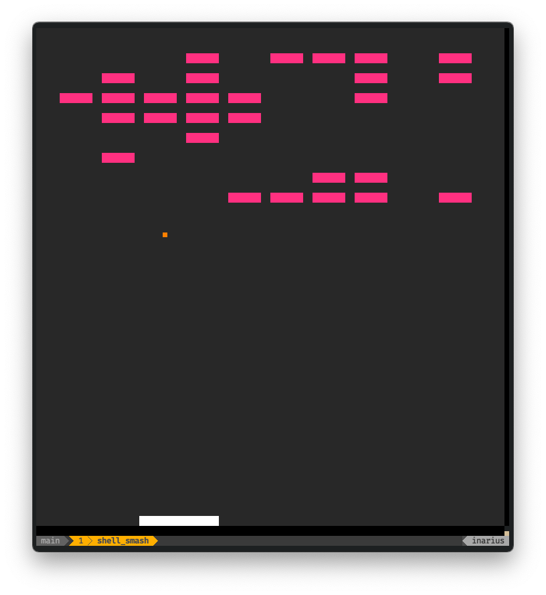

# 👾 Shell Smash ⚙️

## Overview

`shell_smash` is a simple breakout game clone running in the terminal with the
help of the [pixel_loop](https://crates.io/crates/pixel_loop) engine. If you
are interested in its development checkout my YouTube channel
[MrJakob](https://youtube.com/c/mrjakob), where I live code this project as
well as others.



## Build Instructions

To build Shell Smash use `cargo`:

```shell
cargo build --release
```

## Usage

Once built, run the `target/release/shell_smash` binary to start the game.

Start the ball with the `Spacebar` and move the bar with the `cursor keys.
Exit the game with the `Q` key.
